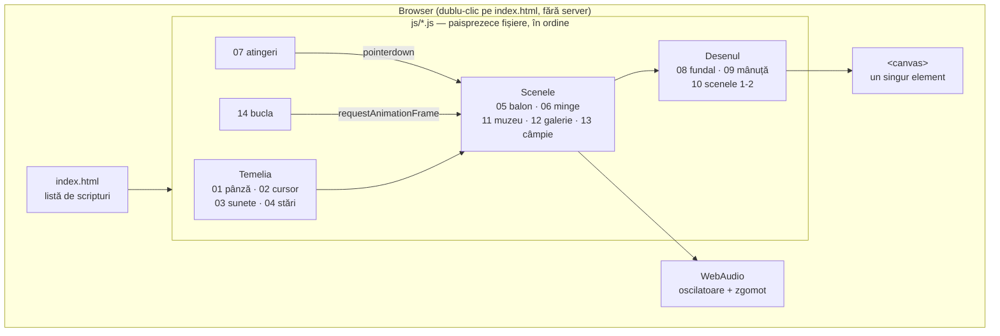
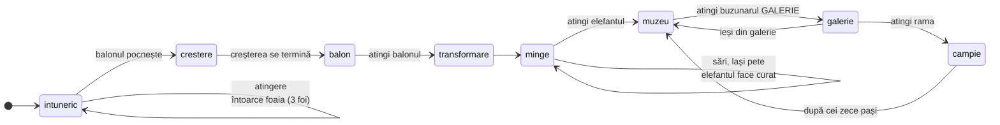
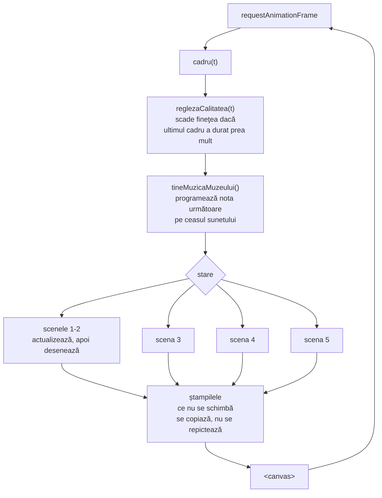
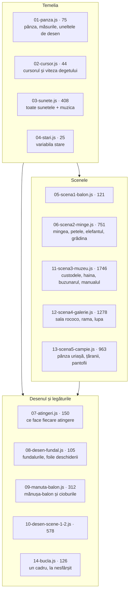
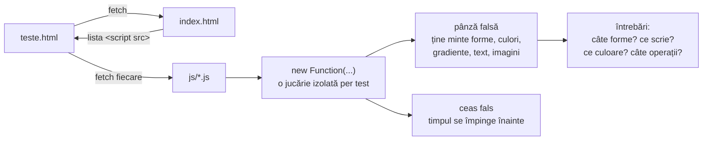
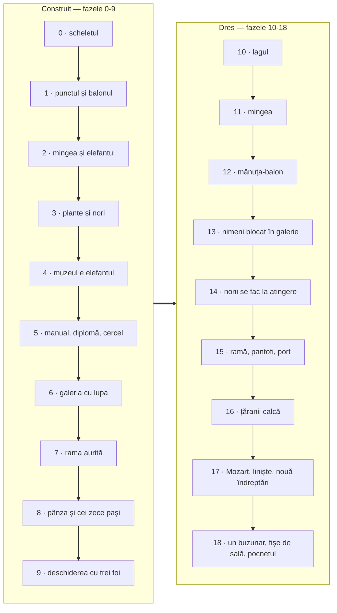
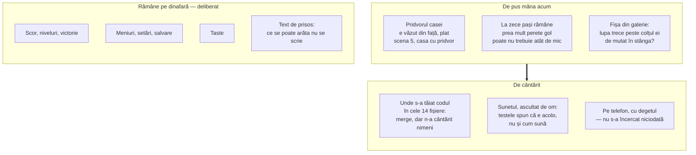

# ARCHITECTURE.md

Document de referință pentru structura tehnică a jucăriei.

> **Stare curentă:** cinci scene întregi și jucabile, 140 de teste care trec.
> Rulează fără server, cu dublu-clic pe `index.html`. Nu are build, nu are
> dependențe, nu are backend.

## Privire de ansamblu

O pagină de canvas 2D, fără biblioteci și fără niciun fișier luat de undeva —
nici imagini, nici sunete. Tot ce se vede iese din `CanvasRenderingContext2D`,
tot ce se aude iese din WebAudio, notă cu notă. `index.html` nu conține cod: e o
listă de paisprezece scripturi obișnuite, încărcate în ordine.

Nu există stat, nu există rutare, nu există date salvate. Tot ce știe jucăria
despre lume stă în câteva obiecte globale, iar la refresh se uită tot.

## Drumul jucătorului

O singură variabilă, `stare`, spune unde ești. Fiecare trecere e pornită de o
atingere, niciodată de un ceas — cu două excepții, marcate punctat: creșterea
punctului, care se termină singură, și întoarcerea din câmpie.

## Cum se naște un cadru

`cadru(t)` e singura funcție chemată de `requestAnimationFrame`. Ea nu desenează
nimic: alege scena, o lasă să-și mute lucrurile cu `dt`, apoi o pune să se
deseneze.

### Ștampilele

Cel mai scump lucru din jucărie e umplerea pixelilor, nu numărul de forme. De-aia
tot ce nu se schimbă de la un cadru la altul se pictează **o dată**, pe o pânză
ascunsă, și pe urmă se copiază.

| Ștampila | Unde | Ce ține |
|---|---|---|
| `stampilePlante` | scena 2 | fiecare soi și culoare de plantă |
| `stampileNori` | scenele 2-3 | norii vopsiți |
| `fundal3` | scena 3 | peisajul cu grădina din jurul custodelui |
| `salaGalerie` | scena 4 | interiorul rococo, întreg |
| `stampilaRamei` | scena 4 | rama aurită a miniaturii |
| `ramaMare` | scena 5 | rama aurită a pânzei uriașe |
| `tabloul` | scena 5 | pictura impresionistă |
| `compunerea`, `marunt` | scena 5 | pânze de lucru pentru pixelare |

## Ce ține fiecare fișier

Ordinea contează: fiecare fișier se sprijină pe cele dinaintea lui. Dacă muți
unul mai sus, ceva de dedesubt rămâne fără pământ.

## Testele

`teste.html` nu copiază codul jucăriei. Citește `index.html`, ia de acolo lista
fișierelor **în ordinea în care le încarcă pagina**, le adună și le rulează cu o
pânză falsă care ține minte fiecare desen. Așa lista are un singur stăpân: un
fișier nou e luat de la sine, și nu se poate întâmpla ca pagina să ruleze un cod
și testele altul.

Se lucrează cu testul scris întâi. Când un test vechi se ceartă cu o cerere nouă,
testul se rescrie ca să apere intenția care a rămas valabilă — niciodată slăbit
în tăcere.

## Fazele

Primele nouă au adus scenele. De la zece în sus n-a mai apărut nicio scenă nouă:
s-a dres ce nu mergea.

Fiecare fază are, în [PLAN.md](PLAN.md), ce s-a stricat și de ce — partea cea mai
folositoare din tot ce e scris aici.

## Ce trebuie făcut în continuare

## Reguli care nu se calcă

1. **Niciun fișier extern.** Tot desenul și tot sunetul se nasc în cod.
2. **Se deschide de pe disc**, cu dublu-clic. De-aia `js/` sunt scripturi
   obișnuite, nu module: modulele nu se încarcă de pe `file://`.
3. **Tot ce ține de timp trece prin `dt`.** Nimic nu depinde de câte cadre pe
   secundă merge ecranul.
4. **Ce se pictează o dată se ștampilează.** Un desen care nu se schimbă de la un
   cadru la altul n-are ce căuta în buclă.
5. **Nimeni nu rămâne blocat.** Orice loc unde trebuie făcut ceva anume are un
   semn care cheamă, și semnul se întărește cu cât treci mai mult fără să
   reușești.
6. **Cod și comentarii în română.** Numele lucrurilor din poveste sunt numele lor
   din cod.
7. **Comentariile spun de ce, nu ce.** Ce face o linie se vede din ea; comentariul
   spune ce s-a stricat când era altfel.
