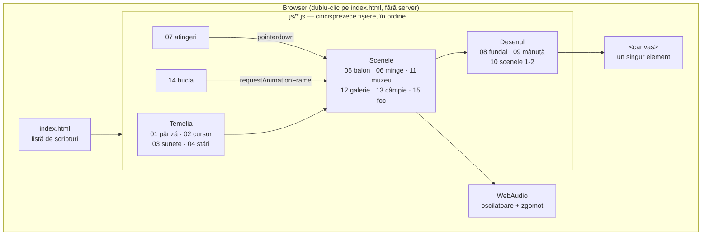
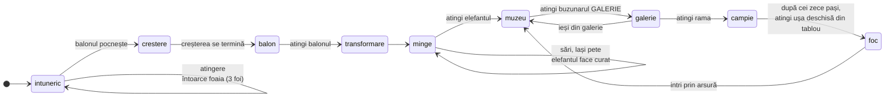
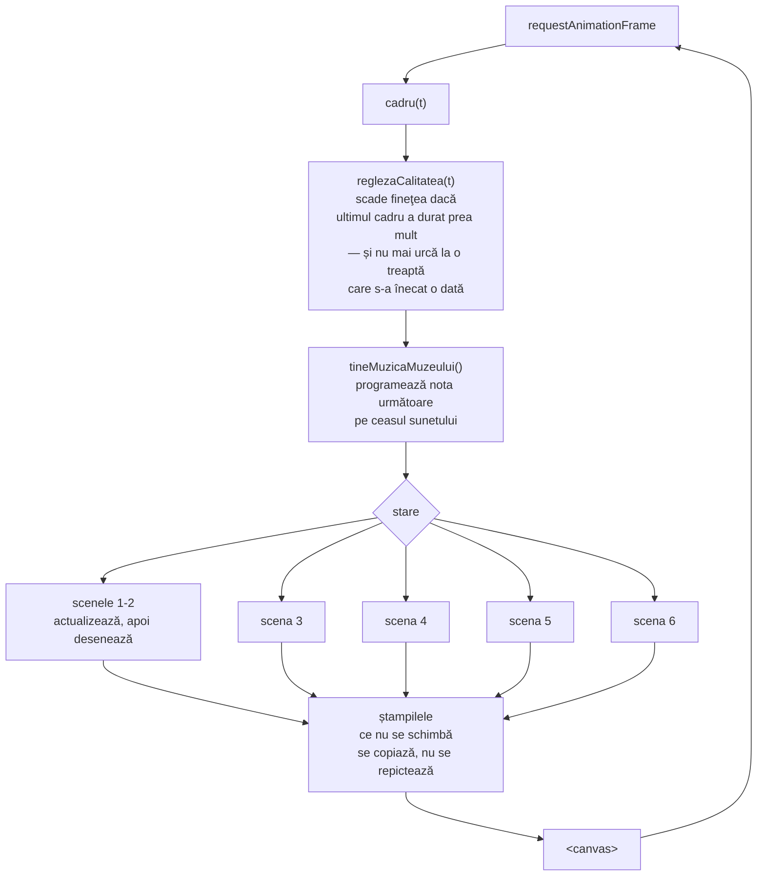
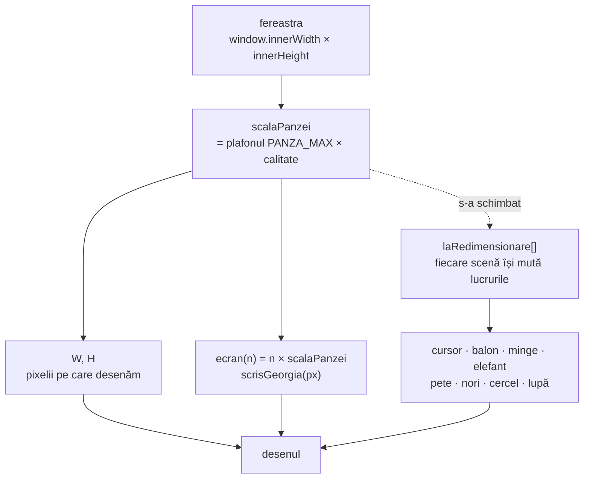
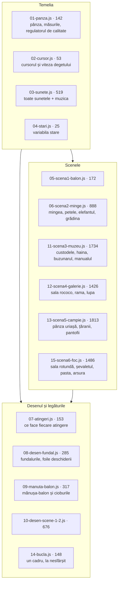
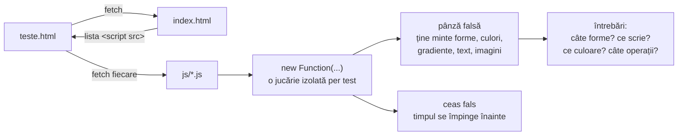
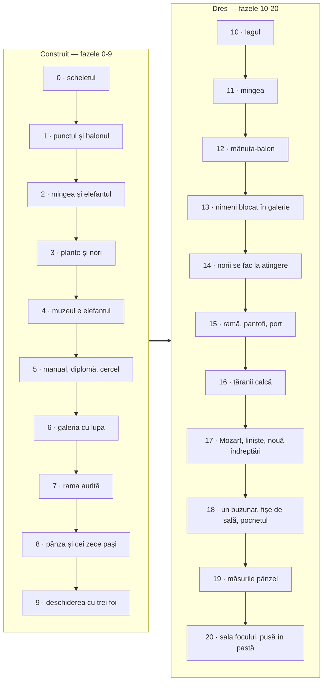
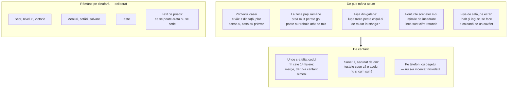

# ARCHITECTURE.md

Document de referință pentru structura tehnică a jucăriei.

> **Stare curentă:** șase scene întregi și jucabile, 196 de teste care trec.
> Rulează fără server, cu dublu-clic pe `index.html`. Nu are build, nu are
> dependențe, nu are backend.

## Privire de ansamblu

O pagină de canvas 2D, fără biblioteci și fără niciun fișier luat de undeva —
nici imagini, nici sunete. Tot ce se vede iese din `CanvasRenderingContext2D`,
tot ce se aude iese din WebAudio, notă cu notă. `index.html` nu conține cod: e o
listă de cincisprezece scripturi obișnuite, încărcate în ordine.

Nu există stat, nu există rutare, nu există date salvate. Tot ce știe jucăria
despre lume stă în câteva obiecte globale, iar la refresh se uită tot.

## Drumul jucătorului

O singură variabilă, `stare`, spune unde ești. Fiecare trecere e pornită de o
atingere, niciodată de un ceas — cu două excepții, marcate punctat: creșterea
punctului, care se termină singură, și întoarcerea din câmpie.

## Cum se naște un cadru

`cadru(t)` e singura funcție chemată de `requestAnimationFrame`. Ea nu desenează
nimic: alege scena, o lasă să-și mute lucrurile cu `dt`, apoi o pune să se
deseneze.

### Ștampilele

Cel mai scump lucru din jucărie e umplerea pixelilor, nu numărul de forme. De-aia
tot ce nu se schimbă de la un cadru la altul se pictează **o dată**, pe o pânză
ascunsă, și pe urmă se copiază.

| Ștampila | Unde | Ce ține |
|---|---|---|
| `stampilePlante` | scena 2 | fiecare soi și culoare de plantă |
| `stampileNori` | scenele 2-3 | norii vopsiți |
| `fundal3` | scena 3 | peisajul cu grădina din jurul custodelui |
| `salaGalerie` | scena 4 | interiorul rococo, întreg |
| `stampilaRamei` | scena 4 | rama aurită a miniaturii |
| `ramaMare` | scena 5 | rama aurită a pânzei uriașe |
| `tabloul` | scena 5 | pictura impresionistă |
| `compunerea`, `marunt` | scena 5 | pânze de lucru pentru pixelare |
| `salaFocului` | scena 6 | sala rotundă: tapetul, pasta de pe pereți, blana |
| `ramaFocului` | scena 6 | rama aurită a lucrării, culcată |
| `fundalTablou` | scena 6 | noaptea și dealurile din lucrare, puse în pastă |

Fiecare ștampilă ține minte la ce mărime a fost pictată și se repictează când
pânza se schimbă. De-aia contează atât de mult ca pânza **să nu se schimbe
degeaba** — vezi capitolul următor.

## Măsurile: pixeli de pânză și pixeli de ecran

Nu desenăm pe ecran, ci pe o pânză plafonată la `PANZA_MAX` pixeli, întinsă pe
urmă cu CSS peste toată fereastra. Pe deasupra, `reglezaCalitatea` mai micșorează
pânza când cadrele întârzie. Deci **`W` și `H` nu sunt lățimea și înălțimea
ferestrei**, iar raportul dintre ele și fereastră (`scalaPanzei`) se schimbă în
timpul jocului.

De aici ies două feluri de greșeli, amândouă văzute pe pielea noastră:

| Greșeala | Cum arată | Leacul |
|---|---|---|
| O mărime scrisă în pixeli rotunzi (`470`, `20px`) | Pe pânză micșorată, lucrul se **umflă**: manualul sărea de la o treime la jumătate de ecran | `ecran(470)`, `scrisGeorgia(20)` |
| O socoteală ținută minte în pixeli de pânză | La schimbarea pânzei, lucrul **rămâne unde era**: cercelul zbura în dreapta ecranului, cu lănțișorul întins peste toată grădina | un ascultător în `laRedimensionare` |

**Regula:** dacă o mărime nu iese din `W`/`H`, trebuie să iasă din `ecran()`. Dacă
o coordonată e ținută minte de la un cadru la altul, scena ei datorează un
ascultător în `laRedimensionare` — sau, mai bine, o ține în fracțiuni de ecran,
cum face grădina, și atunci nu datorează nimic.

### Regulatorul de calitate

`reglezaCalitatea` ține media alunecătoare a timpului dintre cadre și coboară o
treaptă când jocul se poticnește. Trei lucruri care nu se văd din cod la prima
citire, dar fără de care regulatorul face chiar el lagul pe care ar trebui să-l
vindece:

1. **Cadrul schimbării nu se măsoară.** Coborârea unei trepte repictează din
   temelii toate ștampilele scenei — e cel mai scump cadru din jucărie. Pus la
   socoteală, el singur spune „ne înecăm" și cheamă încă o coborâre, care
   repictează iar tot.
2. **Plafonul se închide după o urcare care nu s-a ținut.** Altfel jucăria urcă,
   se îneacă, coboară, urcă iar — la nesfârșit, cu o repictare completă la
   fiecare tur. O poticnire care vine la peste `RASPUNDEREA_URCARII` de la urcare
   e a scenei care s-a deschis între timp, nu a treptei, și nu închide nimic.
3. **Redimensionările ferestrei se adună.** Cât tragi de colț sosesc zeci pe
   secundă, și fiecare ar repicta tot; așteptăm să se oprească mâna.

### Pasta

Scena a șasea e despre valoarea petei picturale, așa că nu poate fi zugrăvită
neted: tema scrisă pe perete și dezmințită de perete. Peretele sălii și fondul
lucrării de pe șevalet se pun amândouă din tușe, cu `pataDePasta`.

O pată de pastă are trei treceri, nu una: corpul, o creastă mai deschisă pe
muchia dinspre lumină și o umbră pe cealaltă. Cu una singură iese o confetti; cu
trei, ochiul citește relief — vopsea groasă, pusă cu pensula. Lumina din sală
vine de la focul din tablou, deci creasta stă mereu spre el.

Și una, și alta stau pe ștampile: peretele pe cea a sălii, fondul lucrării pe a
lui (`fundalTablou`). Numai flăcările se repictează la fiecare cadru — ele chiar
se mișcă.

## Ce ține fiecare fișier

Ordinea contează: fiecare fișier se sprijină pe cele dinaintea lui. Dacă muți
unul mai sus, ceva de dedesubt rămâne fără pământ.

## Testele

`teste.html` nu copiază codul jucăriei. Citește `index.html`, ia de acolo lista
fișierelor **în ordinea în care le încarcă pagina**, le adună și le rulează cu o
pânză falsă care ține minte fiecare desen. Așa lista are un singur stăpân: un
fișier nou e luat de la sine, și nu se poate întâmpla ca pagina să ruleze un cod
și testele altul.

Se lucrează cu testul scris întâi. Când un test vechi se ceartă cu o cerere nouă,
testul se rescrie ca să apere intenția care a rămas valabilă — niciodată slăbit
în tăcere.

## Fazele

Primele nouă au adus scenele. De la zece în sus n-a mai apărut nicio scenă nouă:
s-a dres ce nu mergea.

Fiecare fază are, în [PLAN.md](PLAN.md), ce s-a stricat și de ce — partea cea mai
folositoare din tot ce e scris aici.

## Ce trebuie făcut în continuare

## Reguli care nu se calcă

1. **Niciun fișier extern.** Tot desenul și tot sunetul se nasc în cod.
2. **Se deschide de pe disc**, cu dublu-clic. De-aia `js/` sunt scripturi
   obișnuite, nu module: modulele nu se încarcă de pe `file://`.
3. **Tot ce ține de timp trece prin `dt`.** Nimic nu depinde de câte cadre pe
   secundă merge ecranul.
4. **Ce se pictează o dată se ștampilează.** Un desen care nu se schimbă de la un
   cadru la altul n-are ce căuta în buclă.
5. **Nimeni nu rămâne blocat.** Orice loc unde trebuie făcut ceva anume are un
   semn care cheamă, și semnul se întărește cu cât treci mai mult fără să
   reușești.
6. **Cod și comentarii în română.** Numele lucrurilor din poveste sunt numele lor
   din cod.
7. **Comentariile spun de ce, nu ce.** Ce face o linie se vede din ea; comentariul
   spune ce s-a stricat când era altfel.
8. **Nicio măsură în pixeli rotunzi.** Ce nu iese din `W`/`H` iese din `ecran()`.
   Ce e ținut minte de la un cadru la altul, sau se ține în fracțiuni de ecran,
   sau își pune un ascultător în `laRedimensionare`.
