# ARCHITECTURE.md

Document de referință pentru structura tehnică a jucăriei.

> **Stare curentă:** douăsprezece săli întregi și jucabile, un sfârșit, cincisprezece
> limbi, și 334 de teste care trec. Rulează fără server, cu dublu-clic pe
> `index.html`. Nu are build, nu are dependențe, nu are backend, niciun fișier de
> imagine sau de sunet.

## Privire de ansamblu

O pagină de canvas 2D, fără biblioteci și fără niciun fișier luat de undeva —
nici imagini, nici sunete. Tot ce se vede iese din `CanvasRenderingContext2D`,
tot ce se aude iese din WebAudio, notă cu notă. `index.html` nu conține cod: e o
listă de douăzeci și trei de scripturi obișnuite, încărcate în ordine.

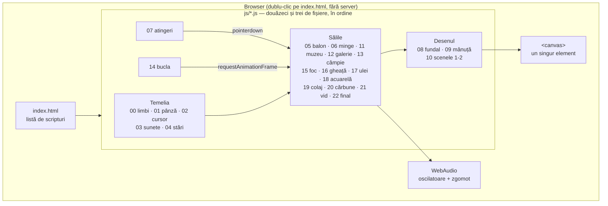

Nu există stat, nu există rutare, nu există date salvate. Tot ce știe jucăria
despre lume stă în câteva obiecte globale, iar la refresh se uită tot.

## Drumul jucătorului

O singură variabilă, `stare`, spune unde ești. Fiecare trecere e pornită de o
atingere, niciodată de un ceas — cu două excepții, marcate punctat: creșterea
punctului, care se termină singură, și întoarcerea din câmpie.

```mermaid
stateDiagram-v2
  direction LR
  [*] --> intuneric
  intuneric --> intuneric : atingere<br/>întoarce foaia (3 foi)
  intuneric --> crestere : balonul pocnește
  crestere --> balon : creșterea se termină
  balon --> transformare : atingi balonul
  transformare --> minge
  minge --> minge : sări, lași pete<br/>elefantul face curat
  minge --> muzeu : atingi elefantul
  muzeu --> galerie : atingi buzunarul GALERIE
  galerie --> campie : atingi rama
  campie --> foc : după cei zece pași,<br/>atingi ușa deschisă din tablou
  foc --> gheata : intri prin arsură
  gheata --> ulei : sari în vârtej
  ulei --> acuarela : urci pe postament,<br/>ceata te ia din locul atins
  acuarela --> colaj : plonjezi în oglindire
  colaj --> carbune : rupi peretele
  carbune --> vid : apeși butonul roșu
  vid --> crestere : atingi punctul<br/>(jucăria o ia de la capăt)
  balon --> final : la ultimul tur,<br/>balonul se face glob
  final --> [*] : îl spargi, și rămâne un nume
  galerie --> muzeu : ieși din galerie
```

## Cum se naște un cadru

Cadrul următor se cere **întâi**, și abia pe urmă se desenează, cu desenul într-o
plasă (`cadru` cheamă `unCadru` într-un `try`). Rândul care cere cadrul următor
stătea la capăt: o singură greșeală dintr-un singur cadru — o mărime ieșită NaN,
un degrade cu rază nefinită — sărea peste el, și jucăria înțepenea pe veci: totul
rămânea pe ecran, nimic nu se mai mișca, și nimeni n-avea de unde ști de ce.
Pentru ceva ce se arată unei clase, ăsta e cel mai rău fel de a se strica. Acum o
greșeală se vede ca o clipire și se scrie o dată în consolă. La teste, dimpotrivă:
acolo se cheamă `unCadru`, cel fără plasă, fiindcă o greșeală trebuie să pice
testul, nu să fie înghițită.

### O ușă lăsată deschisă pe o pânză ascunsă

`taranIn` începe cu `c.save()`, mută originea pe om, îl înclină și îl îngustează,
și se termină cu `c.restore()`. La mijlocul ei, în ramura femeii văzute din spate,
stătea un `return` — pus acolo ca să spună „năframa din spate e gata, nu o mai
desena și pe cea din față". Numai că un `return` nu iese dintr-un `if`, ci **din
toată funcția**, iar `restore`-ul rămânea nefăcut.

Pe pânza ecranului nu s-ar fi văzut: ea se ia de la capăt la fiecare cadru. Dar
oamenii se pictează pe **pânza de compunere**, care se folosește din nou. Mutările
se înmulțeau una peste alta și, după vreo opt cadre, tot ce se desena cădea la
câteva mii de pixeli în afara pânzei, strivit la câteva procente din lățime — până
și ștersul de la începutul cadrului cădea alături.

Din afară: tabloul îngheța exact în clipa în care oamenii se întorceau spre casă,
cu ei rămași în lan ca două dungi subțiri. Nu se blocase nimic — sala mergea mai
departe, dar picta în afara pânzei.

Testele păzesc acum toată clasa asta: după câteva cadre din fiecare sală, fiecare
pânză (și cea a ecranului, și cele ascunse) trebuie să aibă mutarea la loc și
stiva de `save` goală.

Și o a doua lecție, de desen: răsucirea omului era făcută după regula canatului de
ușă — lățimea scădea cu cosinusul unghiului, până se vedea numai muchia. Pentru o
ușă e chiar adevărul, fiindcă o ușă **este** un dreptunghi plat. Un om nu e: strâns
la a șaptea parte din lățime, nu se citește ca întors, ci ca stricat. Acum se
strânge cel mult cu o treime, și de două ori mai repede; întoarcerea se citește
oricum din față-sau-ceafă, nu din lățime.

### Sughițul care se face lag

Două săli întregi se pictează „din vreme", ca să nu cadă tot desenul lor în
primul cadru de acolo: galeria rococo, și rotonda focului. Gând bun, momente
greșite — galeria se picta din faza manualului, adică exact când se **deschide
tomul**; rotonda, cât **mergeau țăranii spre casă**. Amândouă cădeau peste singura
mișcare lungă din sala lor, unde un sughiț se vede cel mai bine. Acum galeria se
pictează de când citești plicul, iar rotonda la intrarea în câmpie — la o
tăietură, unde ochiul așteaptă oricum o schimbare.

Dar mutarea singură n-ar fi de-ajuns, fiindcă sughițul se **înmulțește**: cadrul
scump ridică media, termometrul de fluență îl ia drept înec și coboără o treaptă
de rezoluție, coborârea schimbă mărimea pânzei, mărimea nouă invalidează **toate**
ștampilele, și ele se repictează — încă un cadru scump, care cheamă încă o
coborâre. Dintr-o clipă ies câteva secunde de smucituri. De-aia orice pictură de
ștampilă spune la capăt `uitaCadrul()`: media pornește curată de la cadrul
următor, iar treapta se judecă după cum merge jucăria, nu după cât a durat să fie
pictată.

### Muzica programată înainte trebuie și tăiată

Piesa muzeului se scrie cu un pas înainte, pe ceasul sunetului: o perioadă de opt
măsuri, vreo paisprezece secunde de note, puse la coadă dintr-o dată. Oprirea
ștergea numai ștafeta care le programa; notele deja la coadă sunau mai departe,
fiindcă nimeni nu le mai ținea de mână. La intrarea în sala tabloului mare piesa
se oprește și se pornește iar — deci se auzeau două execuții ale aceleiași piese,
decalate. Acum `nota()` întoarce vocea, ștafeta le ține minte pe cele programate
(două perioade, atât) și `taieVocile` le stinge pe toate în două sutimi.

Tot așa, **pornirea sunetului nu are voie să crape**: `pornesteAudio()` e primul
rând din ascultătorul de atingeri, iar `new AudioContext()` chiar poate să arunce
(fereastră privată, sunet oprit din sistem, browser vechi). Câtă vreme arunca,
atingerea murea acolo: un ecran negru care nu răspunde la nimic, la nesfârșit — pe
un calculator de școală, exact unde nu trebuie. Acum jucăria merge mai departe
mută, și toate sunetele au același paznic la început.

`cadru(t)` e singura funcție chemată de `requestAnimationFrame`. Ea nu desenează
nimic: alege scena, o lasă să-și mute lucrurile cu `dt`, apoi o pune să se
deseneze.

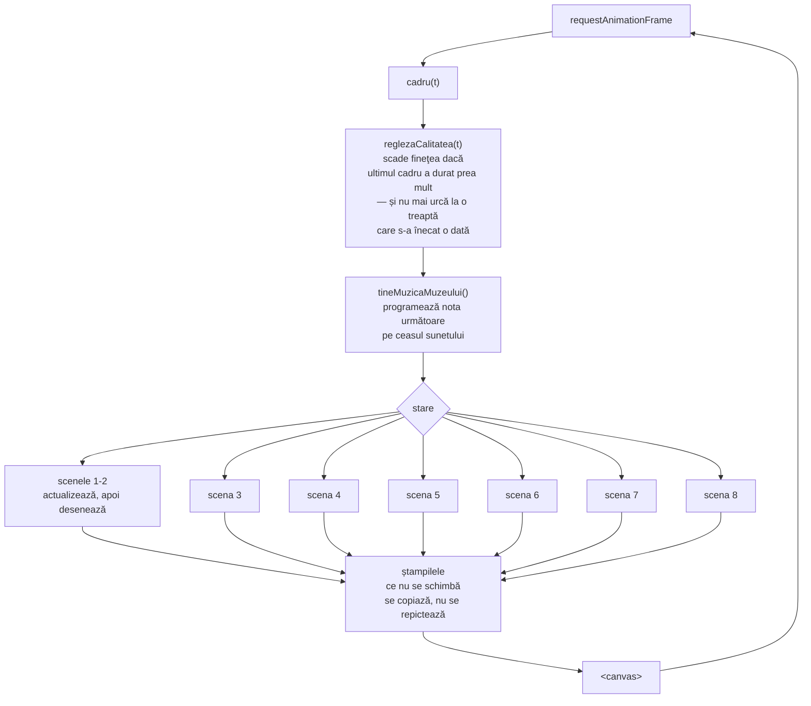

### Ștampilele

Cel mai scump lucru din jucărie e umplerea pixelilor, nu numărul de forme. De-aia
tot ce nu se schimbă de la un cadru la altul se pictează **o dată**, pe o pânză
ascunsă, și pe urmă se copiază.

| Ștampila | Unde | Ce ține |
|---|---|---|
| `stampilePlante` | scena 2 | fiecare soi și culoare de plantă |
| `stampileNori` | scenele 2-3 | norii vopsiți |
| `fundal3` | scena 3 | peisajul cu grădina din jurul custodelui |
| `salaGalerie` | scena 4 | interiorul rococo, întreg |
| `stampilaRamei` | scena 4 | rama aurită a miniaturii |
| `ramaMare` | scena 5 | rama aurită a pânzei uriașe |
| `tabloul` | scena 5 | pictura impresionistă |
| `compunerea`, `marunt` | scena 5 | pânze de lucru pentru pixelare |
| `salaFocului` | scena 6 | sala rotundă: tapetul, pasta de pe pereți, blana |
| `ramaFocului` | scena 6 | rama aurită a lucrării, culcată |
| `fundalTablou` | scena 6 | noaptea și dealurile din lucrare, puse în pastă |
| `salaGheata` | scena 7 | planurile cubiste, vectorii, podeaua, cristalele, fișa |
| `salaUlei` | scena 8 | sala neoclasică desenată în linie: pereții, vitrinele, podiumul, pelerina, trusa, cercul cromatic, fișa |
| `stratulDePictura` | scena 8 | **tot ce a pictat jucătorul** — nu se șterge niciodată |

Fiecare ștampilă ține minte la ce mărime a fost pictată și se repictează când
pânza se schimbă. De-aia contează atât de mult ca pânza **să nu se schimbe
degeaba** — vezi capitolul următor.

## Măsurile: pixeli de pânză și pixeli de ecran

Nu desenăm pe ecran, ci pe o pânză plafonată la `PANZA_MAX` pixeli, întinsă pe
urmă cu CSS peste toată fereastra. Pe deasupra, `reglezaCalitatea` mai micșorează
pânza când cadrele întârzie. Deci **`W` și `H` nu sunt lățimea și înălțimea
ferestrei**, iar raportul dintre ele și fereastră (`scalaPanzei`) se schimbă în
timpul jocului.

De aici ies două feluri de greșeli, amândouă văzute pe pielea noastră:

| Greșeala | Cum arată | Leacul |
|---|---|---|
| O mărime scrisă în pixeli rotunzi (`470`, `20px`) | Pe pânză micșorată, lucrul se **umflă**: manualul sărea de la o treime la jumătate de ecran | `ecran(470)`, `scrisGeorgia(20)` |
| O socoteală ținută minte în pixeli de pânză | La schimbarea pânzei, lucrul **rămâne unde era**: cercelul zbura în dreapta ecranului, cu lănțișorul întins peste toată grădina | un ascultător în `laRedimensionare` |

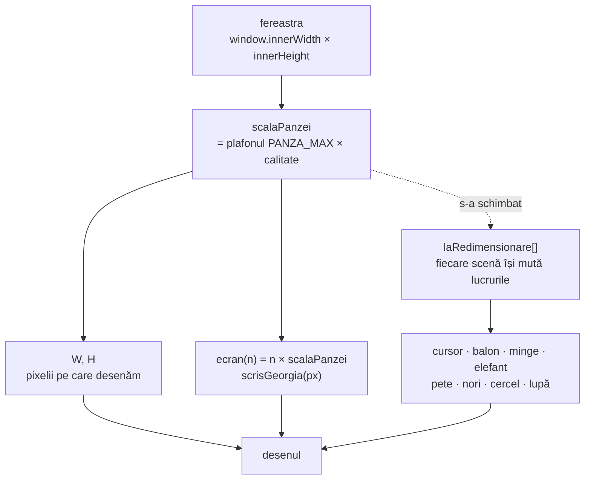

**Regula:** dacă o mărime nu iese din `W`/`H`, trebuie să iasă din `ecran()`. Dacă
o coordonată e ținută minte de la un cadru la altul, scena ei datorează un
ascultător în `laRedimensionare` — sau, mai bine, o ține în fracțiuni de ecran,
cum face grădina, și atunci nu datorează nimic.

### Regulatorul de calitate

`reglezaCalitatea` ține media alunecătoare a timpului dintre cadre și coboară o
treaptă când jocul se poticnește. Trei lucruri care nu se văd din cod la prima
citire, dar fără de care regulatorul face chiar el lagul pe care ar trebui să-l
vindece:

1. **Cadrul schimbării nu se măsoară.** Coborârea unei trepte repictează din
   temelii toate ștampilele scenei — e cel mai scump cadru din jucărie. Pus la
   socoteală, el singur spune „ne înecăm" și cheamă încă o coborâre, care
   repictează iar tot.
2. **Plafonul se închide după o urcare care nu s-a ținut.** Altfel jucăria urcă,
   se îneacă, coboară, urcă iar — la nesfârșit, cu o repictare completă la
   fiecare tur. O poticnire care vine la peste `RASPUNDEREA_URCARII` de la urcare
   e a scenei care s-a deschis între timp, nu a treptei, și nu închide nimic.
3. **Redimensionările ferestrei se adună.** Cât tragi de colț sosesc zeci pe
   secundă, și fiecare ar repicta tot; așteptăm să se oprească mâna.

### Pasta

Scena a șasea e despre valoarea petei picturale, așa că nu poate fi zugrăvită
neted: tema scrisă pe perete și dezmințită de perete. **Tot** ce se vede în ea e
pus din tușe, cu `pataDePasta` — peretele, pardoseala, rama, fondul lucrării,
focul din ea, flacăra care arde tapetul și funinginea de deasupra.

O pată de pastă e o urmă de cuțit, nu un bob de culoare. Are muchii drepte și
colțuri, un capăt gros (unde s-a lăsat lama) și unul rupt (unde s-a ridicat), o
creastă care prinde lumina pe o muchie lungă și o umbră pe cealaltă, plus
râcâiturile lăsate de lamă pe dinăuntru. Creasta și umbra se fac dintr-un singur
truc: același contur, mutat puțin, trasat cu linie groasă și tăiat la forma
petei — din tot conturul mutat rămâne numai dunga de pe muchia dinspre lumină.

Două lucruri decid dacă o suprafață se citește pictată:

| | Greșit | Bine |
|---|---|---|
| **Așezarea** | împrăștiate la sorți — se adună în ciorchini și lasă goluri, iar golurile sunt vopseaua de dedesubt | pe o **rețea cu zvâcnet**: o tușă pe ochi, mutată cu ceva mai puțin de un ochi, lungă cât doi. Se ating, deci acoperă |
| **Proporția** | groase cât late — ies pietre de caldarâm | de patru-cinci ori mai lungi decât late, ca urma unei lame |

Culoarea urmează regula expresionistă: **valoarea** urmează lumina — aprins în
mijloc, stins spre margini, altfel clarobscurul se pierde — dar **tonul sare** de
la o tușă la alta, în lăuntrul aceleiași trepte (`TONURI_APRINSE`,
`TONURI_CALDE`, `TONURI_ARSE`, `TONURI_ADANCI`).

Tot ce nu se mișcă stă pe ștampile: peretele, pardoseala și blana pe cea a sălii;
rama pe a ei; fondul lucrării pe `fundalTablou`. La fiecare cadru se repictează
numai focul, flacăra de pe perete și fumul.

### Cum arde peretele

Lanțul cauzal al scenei trebuie să se vadă, nu doar să se întâmple:

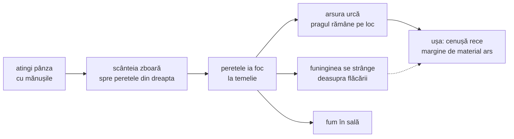

Scânteia zbura înainte, spre colțul de jos-dreapta al ecranului — adică spre
tine, în planul întâi — și pe urmă apărea o gaură în peretele din fund. Nimic din
ce sare în față n-are cum să ardă ceva din spate: ochiul vede traiectoria și
așteaptă focul acolo unde a căzut scânteia.

### Frigul, în deget

Scena a șaptea nu spune că e frig, îl face. Cursorul jocului rămâne al jocului —
o scenă n-are voie să strice unealta celorlalte — dar sala își ține **degetul ei**
(`s7.degetX/Y`), care aleargă după cursorul adevărat cu o iuțeală ce ține de cât
de cald e:

| Treaptă | Când | Ce se simte |
|---|---|---|
| `0.10` | ai atins lucrarea cu mâna goală | aproape nimic nu se mai poate face — asta e pedeapsa |
| `0.45` | frigul sălii, până pornești utilitatea | se umblă, dar trebuie împins |
| `1.00` | după funcția de utilitate | chiar lucrul pe care îl face un costum bun |

Sub `0.45` nu se coboară niciodată în afara înghețului: un cursor care nu ascultă
nu e o senzație, e o defecțiune.

Din îngheț nu se iese apăsând, ci **frecând**: fiecare schimbare de sens a mâinii
umple o bară. Frecarea se măsoară în ascultătorul de mișcare, pe mâna adevărată
(`frecareaScenei7`), nu pe degetul întârziat — cine scutură mouse-ul scutură
repede, iar degetul înghețat n-ar apuca niciodată să-l urmeze.

Aceeași figură se cere a doua oară la sfârșit, ca să se deschidă portalul. Prima
dată freci ca să scapi, a doua oară ca să spargi gheața de pe lucrare: din
aceeași mișcare iese întâi frica, pe urmă puterea.

### Cele trei funcții ale costumului

Sub costum stau trei forme, fiecare cu silueta ei — un **scut**, o **roată
dințată**, o **prismă**. Apeși pe una: în caseta din dreapta se scrie ce face
funcția aceea, iar pe costum se întâmplă altceva de fiecare dată.

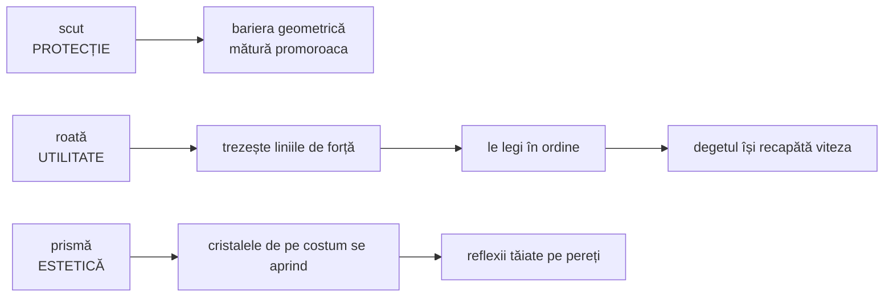

Roata nu leagă ea liniile — le **trezește**. Fapta rămâne a jucătorului; a
mașinii e numai s-o facă cu putință. Iar bariera de la protecție se vede cum
curăță: bruma se desenează numai în afara ei, deci pleacă din locul prin care a
trecut linia.

Costumul e făcut din piese așezate cubist — fața, **spatele**, **latura** și un
petic de **căptușeală**, laolaltă, cum n-au cum să se vadă în realitate. E chiar
ce face un tipar de croitorie, care desface haina în fețe și mâneci și o întinde
pe masă: cubismul și croitoria descompun același lucru. La deschiderea portalului,
obiectul face singur ce a făcut pictorul cu el — se ia în bucăți și se recompune,
iar prin golul de la mijloc se vede drumul.

### Amprenta jucătorului

Sala a opta e singura din toată jucăria în care jucătorul nu se uită la o
lucrare, ci **face** una. De-aia sala vine **desenată numai în linie, complet
necolorată**: un desen de mână, o sală de muzeu neoclasică cu vitrine, podium și
o pelerină regală pe el. Colorată dinainte, n-ar mai fi rămas nimic de făcut în
ea — și tot mesajul sălii („spațiul este pânza ta") ar fi fost o vorbă goală.

Jucătorul are la îndemână două lucruri, sus în stânga: o **trusă de șase
ustensile** (pensulă rotundă, pensulă lată, pensulă de tuș, bidinea, cuțit
ascuțit, cuțit lat) și, sub ea, **cercul cromatic** cu douăsprezece raze. Alege
una și una, și pune pastă unde vrea. Ustensilele lasă urme cu adevărat diferite
— altfel alegerea lor ar fi fost un decor; cuțitele lasă lespezi, pensulele lasă
fire. Cercul e în ordinea roții, fiecare culoare între cele două din care se
face: cine se uită la el învață asta fără să-i spună nimeni.

Tot ce mânjește rămâne, iar asta cere o unealtă anume.

Tușele nu se țin într-o listă redesenată la fiecare cadru — după o sută s-ar
târî — ci pe o **pânză ascunsă** (`stratulDePictura`), peste care fiecare tușă
nouă se pune o singură dată. Pânza aia se copiază la fiecare cadru dintr-o
singură mișcare, oricâtă vopsea ar fi pe ea. E chiar felul în care lucrează un
pictor: nu-și repictează tabloul de la zero când adaugă o tușă.

La schimbarea pânzei, ce ai pictat se întinde pe măsura nouă. Pierdut, ar fi cea
mai urâtă pedeapsă din jucărie: singurul loc unde ai făcut ceva cu mâna ta s-ar
șterge fiindcă ai tras de colțul ferestrei.

Dâra continuă (mâna trasă cu butonul apăsat) se face din `pensuleazaScena8`,
chemată din ascultătorul de mișcare — la fel ca frecarea din sala de gheață.
Fără ea, „lasă-ți amprenta" ar fi însemnat o sută de clicuri, adică o corvoadă,
nu o libertate.

#### Croiala pelerinei, scrisă o singură dată

Poți picta oriunde în sală, dar numai **pelerina** deschide drumul mai departe.
(Dacă s-ar fi socotit toată sala, ai fi terminat lucrarea mâzgălind un colț de
perete — și n-ar mai fi fost o lucrare terminată, ci un contor umplut.)

#### Sfârșitul sălii: lucrarea rămâne, tu pleci

Acoperită de tot, pelerina **se înramează și se agață pe peretele din fund**, în
mijlocul discului portocaliu. De acolo încolo nu se mai mișcă: e un tablou, iar
un tablou agățat stă pe perete.

Sfârșitul ăsta a fost scris de trei ori, și de fiecare dată greșeala a fost
aceeași — lucrarea pleca odată cu jucătorul. Întâi manechinul prindea viață și se
destrăma în lumină; pe urmă podiumul se desfăcea într-o **trapă** și culoarea se
scurgea prin ea, iar tu coborai după ea în acuarelă. Amândouă arătau bine și
spuneau același lucru greșit: că pleci **cu** ce ai pictat, dus de lucrare. Dar
sala tocmai o agățase pe perete. Ce te duce mai departe nu poate să fie tot ea.

Acum drumul are patru pași, și fiecare ia câte ceva din mână:

1. **`inramare`** — lucrarea urcă, se micșorează, primește ramă. Odată cu ea,
   **raftul de unelte iese din cadru** pe unde a venit, iar ultimele picături de
   vopsea își termină drumul și se usucă. Vopseaua proaspătă se prelinge; una
   înrămată nu mai curge — rămâneau atârnate în aer sub tablou, ca și cum pictura
   ar fi sângerat pe perete.
2. **`postament`** — podiumul rămas gol te cheamă, și sala ți-o spune o dată:
   „Ești invitat pe postament." **Unealta îți dispare din mână și rămâne un
   punct.** N-ai ce picta; o pensulă ținută mai departe ar promite că mai e ceva
   de făcut cu ea, și ai căuta. Un punct nu promite nimic, și tocmai de-aia te
   lasă să te uiți în jur.
3. **`ceata`** — clicul pe postament ține minte **unde anume ai apăsat**
   (`s8.ceataX/Y`), și de acolo crește ceata: treizeci și patru de rotocoale
   calde pornite din punctul atins, plus un miez dens chiar sub talpă. Nu e o
   albire a ecranului, e un lucru care crește dintr-un loc — dintre toate
   porțile jucăriei, asta e singura pe care o deschizi punând degetul undeva
   anume, iar locul acela trebuie să se vadă în ce urmează. Altfel ai fi apăsat
   un buton, nu ai fi urcat.
4. **`iesire`** — în ceață nu mai e nici rochie, nici vopsea, nici îndemn scris:
   sala a rămas în urmă cu tot ce era în ea. Numai tu și drumul.

Deci două lucruri trebuie să spună același adevăr: **conturul desenat** și
**socoteala acoperirii**. Amândouă ies din același tabel, `PROFIL_PELERINEI` —
pentru fiecare înălțime, cât e de lată — citit cu `latimeaPelerinei(v)`. Scrise
de două ori, s-ar fi despărțit la prima schimbare: ai fi colorat o pelerină și
ai fi acoperit alta.

Prima variantă socotea acoperirea altfel: desena conturul pe o pânză de lucru și
citea pixelii din ea cu `getImageData`. Corect, dar e cel mai scump lucru pe care
i-l poți cere unei pânze — și, mai rău, cu totul de neîncercat, fiindcă pânza
prefăcută din teste n-are de unde să citească pixeli. Acum e o înmulțire.

Cifrele tabelului spun, de sus în jos: guler îngust, **umerii — cel mai lat lucru
de sus**, o strângere la talie, și abia pe urmă trena revărsată pe podium.
Strângerea aia e tot ce deosebește o mantie de un abajur: un contur care se
lățește de sus până jos fără să se oprească nicăieri se citește ca un clopot,
oricâte broderii i-ai pune pe el. Din același tabel ies și cutele stofei, ca să
se string și ele unde se strânge materialul.

### Impasto: ce am învățat despre pastă

Aceeași unealtă (`pataDePasta`) desenează sala focului și sala uleiului, dar
regulile ei au fost învățate greu, o greșeală pe rând:

| Ce credeam | Ce e de fapt |
|---|---|
| tușe transparente, ca să se vadă suportul | **opace** — o tușă de impasto acoperă tot ce e sub ea; transparente, ies o glazură, adică tehnica opusă |
| lungi și subțiri, ca urma unei lame | **de vreo doi la unu** — la șapte la unu se ascut în sulițe |
| așezate la sorți | pe o **rețea mai deasă decât sunt ele de mari**, deci se calcă una pe alta: din asta iese relieful |
| culoarea trasă la sorți pentru fiecare | **pe zone** — pe o paletă pe care s-a lucrat, culorile stau în insule; la sorți ies boabe de porumb |
| toate de-o mărime | **mărimea sare mult** — toate la fel e un model de tapet, oricât de gros |

Iar suportul trebuie să se vadă: pasta stă în ostroave groase, și între ele se
zărește ce e dedesubt. Acoperit peste tot, suportul dispare cu totul — și atunci
nu mai e o suprafață pictată, ci un covor de vopsea.

### Bucla se închide (sala a douăsprezecea)

Ultima sală n-are nimic în ea, și asta e chiar conținutul ei: negrul absolut de
dinainte ca muzeul să fie desenat — adică exact ecranul cu care a început
jucăria. Celelalte unsprezece au fost despre materie; asta e despre ce era
înainte de materie. Un vid cu ceva în el n-ar mai fi vid, ar fi o cameră
întunecată, iar un test numără operațiile de desen ca să rămână așa.

Negrul de la capătul colapsului din sala a unsprezecea **este** începutul acestei
săli: una se termină în negru absolut, cealaltă începe în negru absolut, și tocmai
cusătura care nu se vede face deja-vu-ul.

Șoapta se spune în două feluri, după cât a mai rămas din jucărie. Prima oară prin
vid mai urmează un tur întreg, iar promisiunea are ce să țină: *„O luăm de la
capăt? Promit că data viitoare elefantul va fi roz!"* — și chiar iese roz. A doua
oară nu mai urmează niciun tur; după el vine globul de sticlă. Atunci rămâne
numai întrebarea: *„O luăm de la capăt?"*

E aceeași regulă care a scris toată sala: **o glumă spusă jucătorului și neținută
e mai rea decât una nespusă**. A promite un elefant roz chiar înainte de sfârșit
ar fi fost o minciună cu termen de o clipă. Iar întrebarea singură sună altfel —
prima oară e o glumă cu o promisiune după ea, a doua oară e o întrebare
adevărată, pusă în gol. Gura spune exact cât spune și ecranul: `sunetSoapta`
primește aceeași hotărâre, și tace partea a doua când textul n-o are.

Niciuna dintre ele
nu e o înregistrare — dar șoapta e, dintre toate felurile de vorbire, singurul
care se poate face cinstit din cod: **o șoaptă chiar e zgomot**. Când șoptești,
coardele vocale nu vibrează deloc; aerul trece prin gură și formele ei îl
filtrează. `sunetSoapta` face exact asta: zgomot alb prin două rezonanțe care se
mută de la o silabă la alta — formantele vocalelor — tăiat în silabe cu pauzele
frazei. Cuvintele scrise pe ecran spun **ce**; sunetul spune **cine**.

#### Sfârșitul: balonul se face sticlă

Bucla nu se învârte la nesfârșit. După două tururi întregi — atâtea cât trebuie
ca promisiunea din vid să fie și făcută, și ținută — balonul de la început nu mai
fuge: crește, se face **glob de Crăciun**, și așteaptă să fie atins. Atins, se
sparge în șaisprezece pene de sticlă care cad, se strâng în mijlocul ecranului și
se sting acolo. Rămâne negrul de la primul cadru al jucăriei, și un nume.

De ce un glob: e singurul lucru care e în același timp **balon** (rotund, ușor,
plin de lumină) și **obiect** (are greutate, are căpăcel, se sparge). Toată
jucăria a fost drumul de la o pată de culoare la un lucru făcut de mână, iar
ultimul obiect îl închide într-o singură formă. Și se **sparge**, nu se
dezumflă: un balon de săpun dispare fără urmă, sticla lasă cioburi — iar
cioburile se întorc chiar în punctul din care a crescut, la început, primul punct
alb.

Ce face un cerc roșu să pară sticlă nu e strălucirea, ci trei lucruri deodată:
partea de sus mai deschisă (lumina care intră), o seceră închisă jos-interior
(peretele din spate, văzut **prin** sticlă) și o pată albă mică și tare
sus-stânga (reflexul ferestrei). Fără secera închisă rămâne o bilă de plastic.

Iar o buclă care nu se închide e o demonstrație tehnică; una care se închide e o
poveste. `TURURI_PANA_LA_FINAL` spune după câte tururi vine globul.

#### Lumea de la capăt

O promisiune făcută jucătorului trebuie ținută, și ținută **întreagă**. La al
doilea tur elefantul e roz — și corpul, și trompa, care se desenează separat ca să
poată urmări petele; culorile stau într-un singur loc (`culorileElefantului`),
fiindcă scrise în două ieșea un elefant roz cu trompa albastră, adică promisiunea
ținută pe jumătate.

Restul lumii, pe dos: trebuie să fie iar de la început. `lumeaDeLaCapat()` pune
înapoi mingea, elefantul, petele, grădina, cerul și numărătoarea scăpărilor
balonului, dintr-o **fotografie** a lor luată la încărcarea fișierelor
(`MINGEA_LA_INCEPUT`, `ELEFANTUL_LA_INCEPUT`) — nu dintr-o listă scrisă de mână,
care s-ar învechi la primul câmp nou fără ca nimeni să vadă, fiindcă greșeala
apare abia la al doilea tur.

Scăparea n-a fost o greșeală de scris, ci una de închipuire: câtă vreme jucăria
mergea o singură dată, nimic nu avea nevoie să se întoarcă, și toată starea a fost
scrisă pentru dus, nu pentru întors. La al doilea tur ieșea o sală a doua goală:
mingea rămânea în buzunarul elefantului, de unde o luase custodele cu un tur
înainte — deci n-aveai ce arunca, nu se făcea nicio pată, iar o singură atingere
pe elefant te trimitea de-a dreptul în muzeu. Și balonul din sala întâi, care se
lasă prins abia după cinci scăpări, ținea minte numărătoarea: la al doilea tur se
preda din prima, adică scena întâi nu se mai juca deloc.

### Se ia, nu se pune (sala a unsprezecea)

Toate sălile de până aici sunt despre **a pune**: culoare, apă, pastă, hârtie
lipită. A unsprezecea e singura despre **a lua**, și asta hotărăște tot ce e
înăuntru.

Cărbunele de pe pereți e o pânză ascunsă din care se **șterge** cu
`destination-out`. E singurul fel cinstit de a face o radieră: orice altceva ar
însemna să desenezi peste negru cu alb, adică să adaugi în loc să iei. Alături stă
o rețea de ochiuri care nu desenează nimic — ea numai numără cât s-a curățat.
Desenul e pe pânză, socoteala e pe rețea.

Stratul ăsta e singura ștampilă din jucărie care **ține datele**, nu doar le
oglindește: se pictează o dată și pe urmă se scrie pe el. Câtă vreme s-a refăcut
la fiecare cadru, ca celelalte, tot ce ștergeai se punea la loc în șaisprezece
milisecunde — radiera mergea, socoteala arăta optzeci la sută curățat, iar pe
ecran peretele stătea negru ca la început.

Sub cărbune stă o pânză de linii de lumină, toate îndreptate spre bloc, plus rama
propriu-zisă tăiată în șaisprezece bucăți. Numai rama e condiția de trecere;
restul liniilor sunt răsplata pentru căutat, ca să nu existe colț de perete unde
munca să nu se plătească.

Blocul de pastă e un heightmap de 22×22, pictat **minúscul** — un pixel de ochi —
și pe urmă întins peste tot blocul, lăsând browserul să netezească între pixeli.
Desenat de-a dreptul, ieșea un zid de cărămidă: pasta n-are muchii drepte
nicăieri, are pante. Crestele, în schimb, se trag **după** întindere și la mărimea
adevărată, fiindcă ele trebuie să fie tăioase. Neted peste tot și ascuțit pe
creste: exact ce e pasta de relief.

La capăt, butonul roșu suge tot muzeul. Colapsul nu redesenează nimic: ia
**imaginea sălii de dinainte** (`iaPozaSalii`), o strânge spre gaură și o
răsucește. Ce se prăbușește trebuie să fie chiar lucrul pe care tocmai îl priveai.
Și, fiindcă pe buton scrie „Apasă-mă iar", după aceea jucăria **începe din nou** —
nu te scoate la custode, ca celelalte săli: custodele tocmai a fost înghițit cu
galeriile lui.

### Sunetul ține locul pipăitului (sala a zecea)

Sala a zecea e singura din toată jucăria în care sunetul nu îmbracă scena, ci
**este** scena. Tema ei e memoria obiectelor, iar experiența cerută e tactilă:
aspru, uscat, înfundat, scrâșnit. Niciuna dintre astea nu se poate desena — pe un
ecran arată toate la fel. Se aud însă imediat și se deosebesc fără să le explice
nimeni: `sunetFosnetHartie`, `sunetCarton`, `sunetSfoaraIncordata`, `sunetNasturi`,
`sunetIuta`, `sunetCrackClei`. Șase materiale, șase glasuri.

De-aceea sala se și stinge la intrare, după textul bătut la mașină („Închide ochii
și simte texturile"): rămâne o umbră sepia și o pată de lumină care merge cu mâna.
Într-o cameră luminată, îndemnul n-ar însemna nimic.

Știrea de radio din 1930 nu e o înregistrare — în jucărie nu intră niciun fișier
de sunet. `stireRadio` face **vocea**, adică exact ce rămâne dintr-un crainic când
nu-l mai înțelegi: silabe tăiate cu pauze (vorbirea e ritm, nu ton continuu),
totul trecut prin banda îngustă a unui aparat cu lămpi, peste un fond de parațiți.

Vizual, tot ce contează e **relieful**: umbra proprie a fiecărei bucăți și muchia
ei luminată dinspre stânga sus (`umbraPiesei`, `muchiaPiesei`). Fără ele,
spoturile calde luminează o suprafață plată și „simte texturile" rămâne o vorbă
goală: pe un ecran, relief înseamnă o dungă de lumină lângă una de umbră, nimic
altceva. Restul — țesătura de iută, unda cartonului, răsucirea funiei — sunt
amănunte care confirmă ce a spus deja muchia.

Peretele stă pe o ștampilă (`pregatestePeretele`): douăzeci și una de bucăți peste
o țesătură de câteva mii de fire, pictate o dată și puse dintr-o mutare.

### Apa duce pigmentul (sala a noua)

Sala a opta și sala a noua sunt două fețe ale aceleiași întrebări: cât din
lucrare e al tău? În ulei, pasta rămâne fix unde ai lăsat-o — tu conduci. În
acuarelă nu se pictează nimic: pe perete stă o foaie cu un desen grafic uscat,
iar jucătorul are în mână un pulverizator. Dă apă; desenul se face singur.

Toată sala stă pe o grilă de udare de 22×22 de ochiuri peste foaie
(`s9.celule`). Fiecare stropire udă un cerc de ochiuri, iar `raspandesteApa()`
mută apa între vecini la fiecare cadru — **fără să se piardă nimic pe drum**, plus
un curent în jos, că foaia stă pe perete. Desenul se citește din grilă: fiecare
linie și fiecare punct își ia grosimea și puterea din câtă apă e sub ele, așa că
laviul crește **dinspre mâna jucătorului**, nu deodată peste tot.

Trei lucruri fac ca o pată să pară acuarelă, și niciunul nu e culoarea:
marginea strâmbă (`conturDeApa`, trei sinusuri cu perioade care nu se împart una
la alta), **marginea mai apăsată decât mijlocul** — pigmentul împins de apă când
balta se usucă, fix pe dos față de creasta de impasto din ulei — și granulația
din adânciturile hârtiei. Singurul lucru fără dungă închisă e soarele: lucrul cel
mai luminos din tablou nu poate avea marginea mai întunecată decât mijlocul.

Laviul întreg costă vreo trei mii de operații de desen, iar când podeaua se face
oglindă s-ar desena de două ori pe cadru. De-aia stă pe o ștampilă
(`panzaLucrarii`), refăcută numai când s-a mișcat apa și cel mult de zece ori pe
secundă; oglindirea din podea folosește **aceeași pânză**, întoarsă. Așa un cadru
al sălii coboară de la vreo trei mii de operații la treizeci și cinci câtă vreme
foaia stă uscată și la vreo opt sute când sala e inundată.

În sala a opta suportul e chiar **desenul în linie**: hârtia albă și conturul de
creion se văd printre tușe, și fiecare pată spune, prin ce acoperă, cât ai lucrat
acolo. (Sala avusese înainte pereți de pânză de sac, făcuți dintr-o plăcuță de
urzeală și bătătură repetată cu `createPattern`. Au căzut odată cu sala colorată:
o textură desenată dinainte e tot o hotărâre luată în locul jucătorului. Lecția
care rămâne din ea e că o țesătură se face din fire care trec **unul peste
altul**, ca la tabla de șah, nu din două rânduri de dungi suprapuse — de acolo
vine sclipirea măruntă care se citește din prima ca „țesut".)

## Limbile

Tot ce citește jucătorul stă în `js/00-limbi.js`, pe cheie. Scenele nu scriu
niciodată o frază: cer `T('muzeu.plic')` și primesc rândul în limba de acum.
Cheia e în română, fiindcă româna e originalul — celelalte paisprezece sunt
tălmăciri după ea.

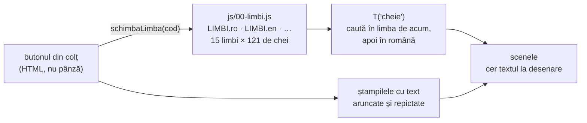

**Textul se cere la desenare, nu la pornire.** De-aia limba se poate schimba în
mijlocul jocului, fără reîncărcare și fără să pierzi drumul făcut până acolo.

**Trei locuri unde a fost nevoie de grijă:**

1. **Ștampilele cu text.** O parte din scris nu se desenează în fiecare cadru, e
   *pictat într-o ștampilă*: fișa de perete din sala uleiului, biletele de pe
   peretele de colaj. Ștampilele se repictează numai la schimbarea mărimii, deci
   ar fi rămas scrise în limba veche. `schimbaLimba` le aruncă pe toate — **afară
   de două**, `stratulDePictura` și `panzaCarbunelui`, care nu conțin niciun
   cuvânt, ci munca jucătorului.

2. **Numerele din frază.** Numărul paginii, câți pași mai sunt, al câtelea
   articol — toate stau în dicționar cu `{n}` la locul lor, nu lipite în față.
   În maghiară numărul vine **înaintea** cuvântului („318. §", „156. oldal"), iar
   un „pagina " + cifră ar fi ieșit pe dos tocmai acolo.

3. **Cuvintele lungi.** Ruperea în rânduri se face după spații, deci un cuvânt
   mai lat decât caseta rămâne un rând întreg și iese din chenar. Germana scrie
   „GEBRAUCHSFUNKTION" într-un singur cuvânt. De-aia `celMaiLatRand` (în
   `08-desen-fundal.js`) e chemată de toate casetele care își caută mărimea
   literei: se măsoară și lățimea, nu numai înălțimea.

**Ce nu s-a luat:** limbile fără spații între cuvinte (chineza, japoneza,
thailandeza) — ruperea în rânduri n-ar avea de ce să se agațe; și cele scrise de
la dreapta la stânga (araba, ebraica) — toate casetele, fișele și plăcuțele sunt
așezate de la stânga, deci n-ar fi o traducere în plus, ar fi o rescriere a
desenului.

Un test scanează codul tuturor scenelor și pică dacă găsește o frază românească
scrisă de-a dreptul, în afara dicționarului. Fără el, un rând uitat nu dă nicio
eroare — rămâne pur și simplu în română pentru toată lumea, și se vede numai
dacă cineva ajunge chiar în sala aia cu limba schimbată. Așa a stat o vreme toată
sala a șaptea.

## Ce ține fiecare fișier

Ordinea contează: fiecare fișier se sprijină pe cele dinaintea lui. Dacă muți
unul mai sus, ceva de dedesubt rămâne fără pământ.

```mermaid
flowchart TB
  subgraph T["Temelia"]
    A0["00-limbi.js · 2228<br/>tot textul, în cincisprezece limbi"]
    A1["01-panza.js · 163<br/>pânza, măsurile, regulatorul de calitate"]
    A2["02-cursor.js · 69<br/>cursorul și viteza degetului"]
    A3["03-sunete.js · 1974<br/>toate sunetele + muzica"]
    A4["04-stari.js · 46<br/>variabila stare"]
  end
  subgraph S["Scenele"]
    B5["05-scena1-balon.js · 172"]
    B6["06-scena2-minge.js · 1016<br/>mingea, petele, elefantul, grădina"]
    B11["11-scena3-muzeu.js · 1937<br/>custodele, haina, buzunarul, manualul"]
    B12["12-scena4-galerie.js · 1471<br/>sala rococo, rama, lupa"]
    B13["13-scena5-campie.js · 2040<br/>pânza uriașă, țăranii, pantofii"]
    B15["15-scena6-foc.js · 1996<br/>sala rotundă, șevaletul, pasta, arsura"]
    B16["16-scena7-gheata.js · 2134<br/>sala de gheață, costumul, portalul"]
    B17["17-scena8-ulei.js · 2978<br/>sala în linie, trusa, cercul cromatic, postamentul"]
    B18["18-scena9-acuarela.js · 1528<br/>foaia, pulverizatorul, laviul, lacul-oglindă"]
    B19["19-scena10-colaj.js · 2136<br/>iuta, ziarul, cartonul, sforile, ruptura"]
    B22["22-final.js · 375<br/>globul de sticlă, cioburile, numele"]
    B21["21-scena12-vid.js · 293<br/>vidul, punctul, șoapta, bucla"]
    B20["20-scena11-carbune.js · 1454<br/>radiera, liniile de lumină, blocul, butonul"]
  end
  subgraph D["Desenul și legăturile"]
    C7["07-atingeri.js · 155<br/>ce face fiecare atingere"]
    C8["08-desen-fundal.js · 292<br/>fundalurile, foile deschiderii"]
    C9["09-manuta-balon.js · 317<br/>mănușa-balon și cioburile"]
    C10["10-desen-scene-1-2.js · 681"]
    C14["14-bucla.js · 187<br/>un cadru, la nesfârșit"]
  end
  T --> S
  T --> D
  S --> D
```

## Testele

`teste.html` nu copiază codul jucăriei. Citește `index.html`, ia de acolo lista
fișierelor **în ordinea în care le încarcă pagina**, le adună și le rulează cu o
pânză falsă care ține minte fiecare desen. Așa lista are un singur stăpân: un
fișier nou e luat de la sine, și nu se poate întâmpla ca pagina să ruleze un cod
și testele altul.

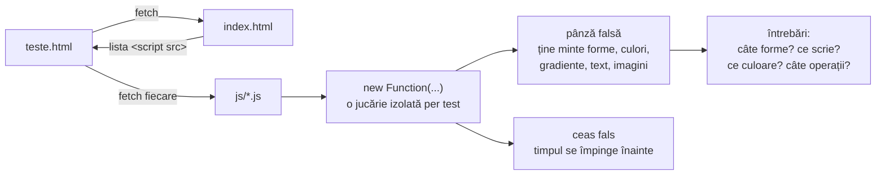

Se lucrează cu testul scris întâi. Când un test vechi se ceartă cu o cerere nouă,
testul se rescrie ca să apere intenția care a rămas valabilă — niciodată slăbit
în tăcere.

## Fazele

Primele nouă au adus scenele. De la zece în sus n-a mai apărut nicio scenă nouă:
s-a dres ce nu mergea.

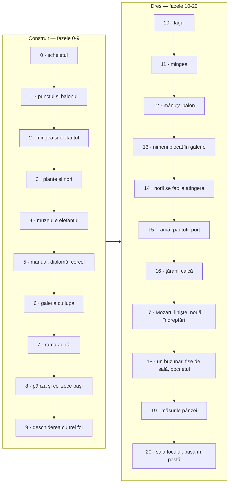

Fiecare fază are, în [PLAN.md](PLAN.md), ce s-a stricat și de ce — partea cea mai
folositoare din tot ce e scris aici.

## Ce trebuie făcut în continuare

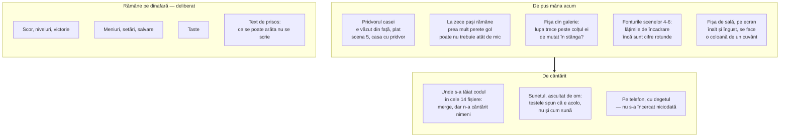

## Reguli care nu se calcă

1. **Niciun fișier extern.** Tot desenul și tot sunetul se nasc în cod.
2. **Se deschide de pe disc**, cu dublu-clic. De-aia `js/` sunt scripturi
   obișnuite, nu module: modulele nu se încarcă de pe `file://`.
3. **Tot ce ține de timp trece prin `dt`.** Nimic nu depinde de câte cadre pe
   secundă merge ecranul.
4. **Ce se pictează o dată se ștampilează.** Un desen care nu se schimbă de la un
   cadru la altul n-are ce căuta în buclă.
5. **Nimeni nu rămâne blocat.** Orice loc unde trebuie făcut ceva anume are un
   semn care cheamă, și semnul se întărește cu cât treci mai mult fără să
   reușești.
6. **Cod și comentarii în română.** Numele lucrurilor din poveste sunt numele lor
   din cod.
7. **Comentariile spun de ce, nu ce.** Ce face o linie se vede din ea; comentariul
   spune ce s-a stricat când era altfel.
8. **Niciun rând de text în afara dicționarului.** Tot ce citește jucătorul se
   cere cu `T('cheie')`, la desenare. O frază scrisă de-a dreptul într-o scenă nu
   se strică — rămâne în română pentru toată lumea, și n-o vede nimeni.
9. **Nicio măsură în pixeli rotunzi.** Ce nu iese din `W`/`H` iese din `ecran()`.
   Ce e ținut minte de la un cadru la altul, sau se ține în fracțiuni de ecran,
   sau își pune un ascultător în `laRedimensionare`.
